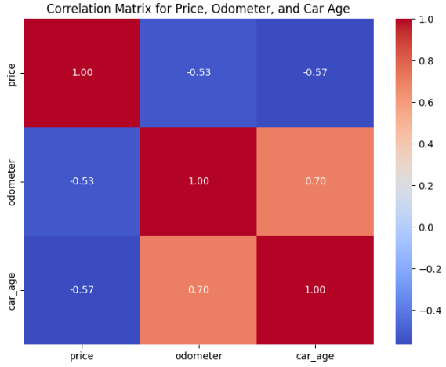

# What drives the price of a car ?

**Himanshu Yadav**

## **OVERVIEW**

In this assignment we will explore a dataset from kaggle. The original dataset contained information on 3 million used cars. The provided dataset contains information on 426K cars to ensure speed of processing.  Your goal is to understand what factors make a car more or less expensive.  As a result of our analysis, we will provide clear recommendations to your client -- a used car dealership -- as to what consumers value in a used car.

### CRISP-DM Framework

To frame the task, throughout our practical applications we will refer back to a standard process in industry for data projects called CRISP-DM. This process provides a framework for working through a data problem.

### Business Understanding to Data Problem Definition
**Business Problem:** Identifying key drivers for used car prices to guide inventory decisions for a used car dealership.

**Data Problem Definition:** The task is to develop a predictive model that can accurately determine the price of used cars based on their attributes. This involves analyzing historical data to identify which features (like make, model, year, mileage, condition) most significantly impact the selling price. The model needs to be robust, interpretable, and capable of handling large-scale data to provide actionable insights for strategic decision-making.

### Data Understanding

**Available features**
- id: A unique identifier for the car.
- region: The region in which the car is being sold.
- price: The selling price of the car (our target variable).
- year: The year the car was manufactured.
- manufacturer: The make of the car.
- model: The model of the car.
- condition: The condition of the car (like new, used, etc.).
- cylinders: The number of cylinders in the car’s engine.
- fuel: The type of fuel the car uses.
- odometer: The mileage of the car.
- title_status: The legal status of the car (clean, salvage, etc.).
- transmission: The type of transmission (automatic, manual).
- VIN: The Vehicle Identification Number.
- drive: The type of drive (FWD, RWD, AWD).
- size: The size category of the car.
- type: The body type of the car.
- paint_color: The color of the car.
- state: The state in which the car is being sold.

### **After studying the data it was concluded that it would be best to create a model per vehicle type as prices significantly vary based on type of vehicle and they cannot be judged on same scale.**

 ### Data Preparation
 Next step is to prepare the data for modelling. Following actions were taken during data preparation steps.  
- Drop unwanted columns
   - Dropped **Size and Cylendar** due to large numhber of missing values
   - Dropped **VIN** and **ID** as they should not have any impact on prices.
   - Dropped **Region** and **Model** to reduce number of features.
   - **Year** was converted to **car_age** and year was dropped
   - dropped **paint** as too many missing values color should not have too much impact on price. 
- handle junk data
  - Only considered vehicles made after 1999 . Vehicles older than 2000 can be considered antique. Such vehicles are priced very differently and should be considered through separate model .
  - Only considering vehicles with price range between 100 and 500000 to get rid of outliers.
  - To get rid of junk data only rows with **Odometer** value between **0 to 300000**
- handle missing values.
   - **Unknown** was added to rest of missing values
- Encoding Categorical Variables - 
  Many machine learning models require all input data to be numeric. Encoding categorical variables is essential to convert them into a format that can be provided to machine learning algorithms.

**Method: One-Hot Encoding**
One-Hot Encoding creates a binary column for each category and is suitable for nominal categorical data where no ordinal relationship exists.
- Data scaling - 
  Data Normalization or Scaling
Scaling numerical data, especially when the data spans several orders of magnitude, can improve the performance of many algorithms.

Scaling Methods:
Standard Scaling (Z-score scaling): This scales the features based on the standard deviation and mean. It’s effective when data follows a normal distribution.

**Correlation analysis**

Here's the correlation matrix for the price, odometer, and car age. The key insights from the matrix are:

- Price and Odometer: There's a negative correlation (-0.42), suggesting that higher mileage (odometer reading) is associated with lower prices, which aligns with expectations.
- Price and Car Age: The negative correlation (-0.41) indicates that older cars tend to be priced lower, another intuitive finding. These insights suggest that both odometer readings and car age are significant factors in determining used car prices.

### **Modeling**

**Liner Regression** and **Ridge regression** 
- split data
- training
- comparing performance using **RSME**

Performance of both are very close with slight edge to **Ridge.**
**Hyperparameter** for Ridge was further tuned.

### Evaluation

#### **Evaluating Alpha and RMSE**

**General Observations**
- **Optimal Alpha Variability:**
  - For most vehicle types, an alpha of 1 seems to provide the best balance between bias and variance, minimizing the RMSE.
  - Vehicle types like 'convertible', 'offroad', 'pickup', 'truck', and 'wagon' benefit from other alpha values, indicating different levels of  sensitivity to model complexity and regularization strength. For example:
    - **Lower Alphas (0.1):** Better for 'convertible' and 'wagon', suggesting minimal regularization beyond the basic is needed.
    - **Higher Alphas (10):** Better for 'offroad', 'pickup', and 'truck', suggesting these types might have data that are more prone to overfitting or have more complex underlying patterns that require stronger regularization.
- **Performance Metrics (RMSE):**
  - The RMSE values vary significantly across vehicle types, reflecting the diversity in data distribution, volume, and inherent noise within each category.
  - Lower RMSE values in 'hatchback' and 'mini-van' suggest models for these types are particularly effective at capturing the necessary predictors of price with less error.
  - Higher RMSE values for 'convertible' and 'coupe' could indicate more variability in prices or less predictability based on available features.
- **Specific Insights**
  - Best Performing Models: Models for 'hatchback' and 'mini-van' have notably low RMSEs, suggesting the features selected and the model structure are well-suited for predicting prices in these categories.
  - Challenges in High RMSE Categories: For categories like 'convertible' and 'coupe' where RMSE is relatively high, it might be useful to investigate further:
    - Could additional features improve the model?
    - Are there outliers or extreme values skewing the results?
    - Is there a need for more advanced modeling techniques or non-linear models?

## Deployment anmd final findings.

#### Summary of Feature Importance Across Vehicle Types

The analysis of feature importance provides significant insights into factors influencing vehicle pricing and characteristics by category. Here are the key findings for each vehicle type:

#### SUVs
SUVs: Seems like **Manufacturer** is the biggest influencer in this category.
Tesla, Porsche, and Land Rover models show positive coefficients, indicating a higher price or desirability, while Fiat and Mitsubishi are negatively associated with SUV pricing.
- **Positive Influences**: Tesla, Porsche, Land Rover
- **Negative Influences**: Fiat, Mitsubishi

#### Buses
- Seeing something strange here. New condition on busses seem to drive the prices lower. 
- Diesel busses preffered over Electric
- Honda and Mercedes not preffered in this category.
- Prices are really low in Hawai and Washington but higher in Arizona.
- **Positive Influences**: Volkswagen, Diesel fuel
- **Negative Influences**: Honda, New condition

#### Convertibles
- Ferrari, Aston Martin, Dodge and big drivers of prices. 
- Electric fuel is not preffered in this category
- **Positive Influences**: Ferrari, Aston Martin
- **Negative Influences**: Fiat, Electric fuel

#### Coupes
- Ferrari leads this sector.
- Seems like state of Utah has more demand for such vehicles.
- **Positive Influence**: Ferrari dominates the feature importance, suggesting a premium pricing effect.
- **Negative Influences**: Fiat, Electric fuel

#### Hatchbacks
- Manufacturer is biggest influencer here.
- **Positive Influences**: Porsche, Tesla
- **Negative Influences**: Mitsubishi, Fiat

#### Mini-vans
- In this category brand name is of less importance.
- New Condition and Diesel fuel drive prices up. Any condition lower than new significantly bring down the price.
- Prices in Alaska are high for Mini Vans
- **Positive Influences**: New condition, Diesel fuel
- **Negative Influences**: Good condition, Older car age

#### Offroad
- Older cars are not preffered in this category as indicated by Car_age and odometer negatively influencing the prices.
- Toyota and Jeep are top brands.
- Prices are higher in Tennesssee and Colorado
- four wheel drives are must
- **Positive Influences**: Toyota, Four-wheel drive
- **Negative Influences**: Age, Odometer

#### Other
- Ferrari and Porsche lead the market.
- **Positive Influences**: Ferrari, Tesla
- **Negative Influences**: Harley-Davidson, Fiat

#### Pickups
- Diesel is preffered.
- Price drop significantly for older vehicles.
- **Positive Influences**: Diesel fuel, Four-wheel drive
- **Negative Influences**: Salvage title status, Older vehicles

#### Sedans
- Manufacturer is the biggest factor. Porsche, Aston Martin and Ram are most expensive brands. Fiat, Hyundai, Harley ahve cheapest cars.
- **Positive Influences**: Porsche, Aston Martin, Ram
- **Negative Influences**: Hyundai, Kia

#### Trucks
- **Positive Influence**: Diesel fuel
- **Negative Influences**: Unknown title status, Mitsubishi

#### Vans
- **Positive Influences**: New condition, Diesel fuel
- **Negative Influences**: Salvage title, Jeep

#### Wagons
- **Positive Influence**: Tesla shows the highest positive influence.
- **Negative Influences**: Fiat, Missing title status

### **These insights can guide marketing strategies, pricing models, and inventory selections tailored to optimize for the factors most significantly impacting market value in each vehicle category.**

